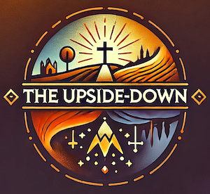

# The Upside-Down Blog

Welcome to The Upside-Down blog, a place where paradox and mystery come alive in the light of the Gospel. This blog was born out of a desire to dive deep into the surprising, counter-cultural ways of God’s Kingdom—a Kingdom that defies worldly wisdom and expectations.

This blog is a space for exploring these rich, biblical themes. We delve into the Scriptures to uncover the deep, counter-intuitive truths of God’s Kingdom and apply them to the challenges of daily life. Each post is an invitation to rethink what it means to follow Jesus in a world that is often at odds with His teaching. Whether discussing the tension between humility and greatness, or examining the paradox of finding life by losing it, this blog seeks to encourage believers to embrace the subversive beauty of the Gospel.

------------------------------------------------------------------------
